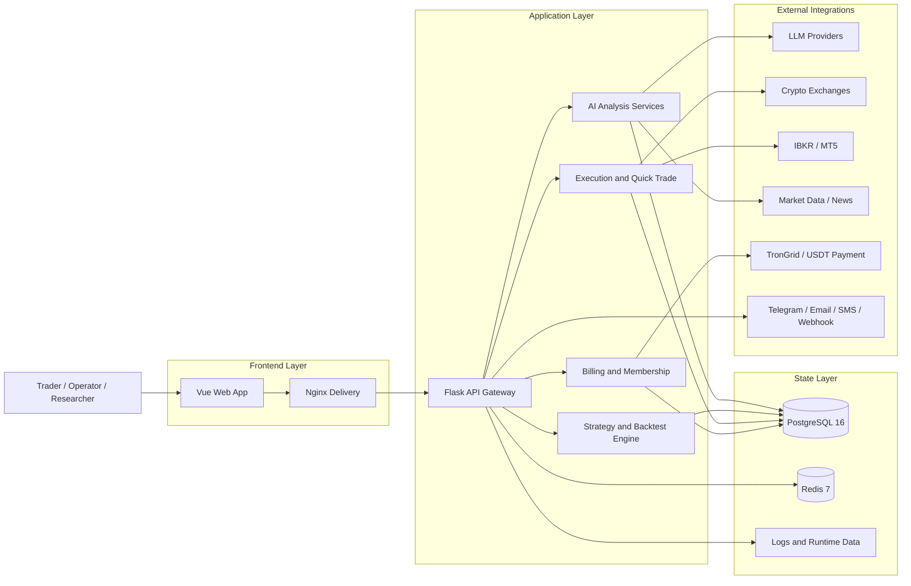

<div align="center">
  <a href="https://github.com/brokermr810/QuantDinger">
    
  </a>

  <h1>QuantDinger</h1>
  <h3>Self-Hosted AI-Native Quant Research, Strategy, Backtesting, and Trading Platform</h3>
  <p><strong>Build, test, and run trading workflows with AI analysis, Python strategies, live execution, and operations on your own infrastructure.</strong></p>

  <p>
    <a href="README.md"><strong>English</strong></a> &nbsp;·&nbsp;
    <a href="docs/README_CN.md"><strong>简体中文</strong></a> &nbsp;·&nbsp;
    <a href="https://ai.quantdinger.com"><strong>Live Demo</strong></a> &nbsp;·&nbsp;
    <a href="https://youtu.be/HPTVpqL7knM"><strong>Video Demo</strong></a> &nbsp;·&nbsp;
    <a href="https://www.quantdinger.com"><strong>Community</strong></a>
  </p>

  <p>
    <a href="LICENSE"></a>
    
    
    
    
    
  </p>
</div>

---

## What Is QuantDinger?

QuantDinger is a **self-hosted AI trading platform** and **quant research workspace** for teams and operators who want one system for:

- AI market analysis
- Python indicator and strategy development
- backtesting and strategy persistence
- live trading execution
- portfolio monitoring and alerts
- multi-user operations, billing, and commercialization

If you are searching for an **open source quant platform**, **AI trading research stack**, **self-hosted backtesting system**, or **natural-language-to-Python strategy workflow**, this is what QuantDinger is built for.

## Why QuantDinger

- **Self-hosted by design**: your credentials, strategy code, market workflows, and operational data stay under your control.
- **Research to execution in one product**: AI analysis, charting, strategy logic, backtests, quick trade, and live operations are connected.
- **Python-native and AI-assisted**: write indicators and strategies directly in Python, or use AI to accelerate drafting and iteration.
- **Built for operators, not just demos**: Docker Compose, PostgreSQL, Redis, Nginx, health checks, worker toggles, and environment-based configuration.
- **Commercialization-ready**: memberships, credits, admin management, and USDT payment flows are already part of the stack.

## Who It Is For

- **Traders and quants** who want AI-assisted market research without giving up control of infrastructure and data.
- **Python strategy developers** who want charting, backtests, and live execution in one environment.
- **Small teams and studios** building internal trading tools or private research platforms.
- **Operators and founders** who need a deployable product with user management, billing, and admin controls.

## What You Can Do With QuantDinger

### AI Research and Decision Support

- Run fast AI-driven market analysis across price action, kline structure, macro/news context, and selected external inputs.
- Store analysis history and memory for repeatable review and future calibration.
- Configure multiple LLM providers such as OpenRouter, OpenAI, Gemini, DeepSeek, and more.
- Optionally enable ensemble and calibration-style flows for more robust AI outputs.

### Indicator and Strategy Development

- Build `IndicatorStrategy` workflows for dataframe-based signals, chart overlays, and signal backtests.
- Build `ScriptStrategy` workflows for stateful runtime logic, explicit order control, and live execution alignment.
- Generate indicator or strategy code from natural language and refine it in Python.
- Visualize indicators, buy/sell signals, and strategy output directly on professional chart interfaces.

### Backtesting and Iteration

- Run historical backtests with stored trades, metrics, and equity curves.
- Backtest both indicator-driven logic and saved strategy records.
- Persist strategy snapshots and review historical runs for reproducibility.
- Use AI-assisted post-backtest analysis to improve parameters and execution assumptions.

### Live Trading and Operations

- Connect crypto exchanges through a unified execution layer.
- Use quick-trade flows to go from analysis to action faster.
- Monitor open positions, review trade history, and close positions from the platform.
- Run automated or semi-automated strategy workflows with runtime services and workers.

### Multi-Market Coverage

- Crypto spot and derivatives
- US stocks through IBKR
- Forex through MT5
- Prediction market research through Polymarket analysis workflows

### Multi-User, Alerts, and Billing

- PostgreSQL-backed multi-user system with role-based access patterns.
- OAuth support for Google and GitHub.
- Notification channels including Telegram, Email, SMS, Discord, and Webhooks.
- Membership plans, credits, USDT TRC20 payments, and admin-side billing controls.

## AI Capabilities

QuantDinger is not just "LLM chat added to a trading app". The current AI layer is integrated into the actual research and strategy workflow.

### Fast Analysis

- Structured AI market analysis for quick decision support
- Lower-latency workflow than older multi-hop orchestration
- Useful for daily market review, trade planning, and opportunity screening

### AI Strategy and Indicator Generation

- Natural language to Python indicator code
- Natural language to strategy code and config scaffolding
- Better fit for traders who know the idea they want, but want to accelerate implementation

### Analysis Memory and Review

- Historical analysis storage
- Better repeatability and comparison over time
- A foundation for future calibration and reflection loops

### Ensemble, Calibration, and Reflection

- Optional multi-model ensemble configuration
- Confidence calibration and reflection-style worker support
- Better operational path for teams that want more stable AI-assisted workflows

### AI-Assisted Backtest Feedback

- Backtest outputs can feed into AI-generated suggestions
- Useful for parameter tuning, risk adjustments, and faster iteration

### Polymarket and Cross-Market Research

- Analyze prediction markets as a research workflow
- Compare AI view versus market-implied probabilities
- Surface divergence and opportunity scoring

## Why It Is Different

Most trading stacks give you one or two of these pieces. QuantDinger aims to give you the full operating system:

1. **Self-hosted infrastructure**
2. **AI research workflows**
3. **Python strategy development**
4. **Backtesting**
5. **Live execution**
6. **Portfolio and notification operations**
7. **Commercialization primitives**

That combination is the core difference.

## Visual Tour

<table align="center" width="100%">
  <tr>
    <td colspan="2" align="center">
      <a href="https://youtu.be/HPTVpqL7knM"></a>
    </td>
  </tr>
  <tr>
    <td width="50%" align="center"><br/><sub>Indicator IDE, charting, backtest, and quick trade</sub></td>
    <td width="50%" align="center"><br/><sub>AI asset analysis and opportunity radar</sub></td>
  </tr>
  <tr>
    <td align="center"><br/><sub>Trading bot workspace and automation templates</sub></td>
    <td align="center"><br/><sub>Strategy live operations, performance, and monitoring</sub></td>
  </tr>
</table>

## How It Works

At a practical level, QuantDinger runs as a self-hosted application stack:

- a prebuilt Vue frontend served by Nginx
- a Flask API backend with Python services
- PostgreSQL for state, users, strategies, and history
- Redis for worker support and runtime coordination
- exchange, broker, AI, payment, and notification integrations through configurable adapters

### Architecture Summary

| Layer | Technology |
|-------|-----------|
| Frontend | Prebuilt Vue application served by Nginx |
| Backend | Flask API, Python services, strategy runtime |
| Storage | PostgreSQL 16 |
| Cache / worker support | Redis 7 |
| Trading layer | Exchange adapters, IBKR, MT5 |
| AI layer | LLM provider integration, memory, calibration, optional workers |
| Billing | Membership, credits, USDT TRC20 payment flow |
| Deployment | Docker Compose with health checks |

### Execution Model

- Market data is pulled through a pluggable data layer.
- Backtests run on the server-side strategy engine, including strategy snapshot handling.
- Live strategies run through runtime services that generate order intent.
- Pending orders are then dispatched through exchange-specific execution adapters.
- Crypto live execution is intentionally separated from market-data collection concerns.

### System Diagram



## Quick Start

> Requirement: install [Docker](https://docs.docker.com/get-docker/). Node.js is not required for deployment because this repository already includes the prebuilt frontend in `frontend/dist`.

### Linux / macOS

```bash
git clone https://github.com/brokermr810/QuantDinger.git
cd QuantDinger
cp backend_api_python/env.example backend_api_python/.env
./scripts/generate-secret-key.sh
docker-compose up -d --build
```

### Windows PowerShell

```powershell
git clone https://github.com/brokermr810/QuantDinger.git
cd QuantDinger
Copy-Item backend_api_python\env.example -Destination backend_api_python\.env
$key = py -c "import secrets; print(secrets.token_hex(32))"
(Get-Content backend_api_python\.env) -replace '^SECRET_KEY=.*$', "SECRET_KEY=$key" | Set-Content backend_api_python\.env -Encoding UTF8
docker-compose up -d --build
```

After startup:

- Frontend: `http://localhost:8888`
- Backend health check: `http://localhost:5000/api/health`
- Default login: `quantdinger` / `123456`

Important deployment notes:

- The backend container will **not start** if `SECRET_KEY` still uses the default value.
- The main application config lives in `backend_api_python/.env`.
- Root `.env` is optional and is mainly used for image mirrors or custom ports.
- The default stack includes `frontend`, `backend`, `postgres`, and `redis`.

### Common Docker Commands

```bash
docker-compose ps
docker-compose logs -f backend
docker-compose restart backend
docker-compose up -d --build
docker-compose down
```

### Optional Root `.env`

If you need custom ports or image mirrors, create a root `.env`:

```ini
FRONTEND_PORT=3000
BACKEND_PORT=127.0.0.1:5001
IMAGE_PREFIX=docker.m.daocloud.io/library/
```

## Supported Markets, Brokers, and Exchanges

### Crypto Exchanges

| Venue | Coverage |
|-------|----------|
| Binance | Spot, Futures, Margin |
| OKX | Spot, Perpetual, Options |
| Bitget | Spot, Futures, Copy Trading |
| Bybit | Spot, Linear Futures |
| Coinbase | Spot |
| Kraken | Spot, Futures |
| KuCoin | Spot, Futures |
| Gate.io | Spot, Futures |
| Deepcoin | Derivatives integration |
| HTX | Spot, USDT-margined perpetuals |

### Traditional Markets

| Market | Broker / Source | Execution |
|--------|------------------|-----------|
| US Stocks | IBKR, Yahoo Finance, Finnhub | Via IBKR |
| Forex | MT5, OANDA | Via MT5 |
| Futures | Exchange and data integrations | Data and workflow support |

### Prediction Markets

Polymarket is currently supported as a **research and analysis workflow**, not as direct in-platform live execution. It is useful for market lookup, divergence analysis, opportunity scoring, and AI-assisted review.

## Strategy Development Modes

QuantDinger supports two main strategy authoring models:

### IndicatorStrategy

- dataframe-based Python scripts
- `buy` / `sell` signal generation
- chart rendering and signal-style backtests
- best for research, indicator logic, and visual strategy prototyping

### ScriptStrategy

- event-driven `on_init(ctx)` / `on_bar(ctx, bar)` scripts
- explicit runtime control with `ctx.buy()`, `ctx.sell()`, `ctx.close_position()`
- best for stateful strategies, execution-oriented logic, and live alignment

For the full developer workflow, see:

- [Strategy Development Guide](docs/STRATEGY_DEV_GUIDE.md)
- [Cross-Sectional Strategy Guide](docs/CROSS_SECTIONAL_STRATEGY_GUIDE_EN.md)
- [Strategy Examples](docs/examples/)

## Repository Layout

```text
QuantDinger/
├── backend_api_python/      # Open backend source code
│   ├── app/routes/          # REST endpoints
│   ├── app/services/        # AI, trading, billing, backtest, integrations
│   ├── migrations/init.sql  # Database initialization
│   ├── env.example          # Main environment template
│   └── Dockerfile
├── frontend/                # Prebuilt frontend delivery package
│   ├── dist/
│   ├── Dockerfile
│   └── nginx.conf
├── docs/                    # Product, strategy, and deployment documentation
├── docker-compose.yml
├── LICENSE
└── TRADEMARKS.md
```

## Configuration Areas

Use `backend_api_python/env.example` as the primary template. Key areas include:

| Area | Examples |
|------|----------|
| Authentication | `SECRET_KEY`, `ADMIN_USER`, `ADMIN_PASSWORD` |
| Database | `DATABASE_URL` |
| LLM / AI | `LLM_PROVIDER`, `OPENROUTER_API_KEY`, `OPENAI_API_KEY` |
| OAuth | `GOOGLE_CLIENT_ID`, `GITHUB_CLIENT_ID` |
| Security | `TURNSTILE_SITE_KEY`, `ENABLE_REGISTRATION` |
| Billing | `BILLING_ENABLED`, `BILLING_COST_AI_ANALYSIS` |
| Membership | `MEMBERSHIP_MONTHLY_PRICE_USD`, `MEMBERSHIP_MONTHLY_CREDITS` |
| USDT Payment | `USDT_PAY_ENABLED`, `USDT_TRC20_XPUB`, `TRONGRID_API_KEY` |
| Proxy | `PROXY_URL` |
| Workers | `ENABLE_PENDING_ORDER_WORKER`, `ENABLE_PORTFOLIO_MONITOR`, `ENABLE_REFLECTION_WORKER` |
| AI tuning | `ENABLE_AI_ENSEMBLE`, `ENABLE_CONFIDENCE_CALIBRATION`, `AI_ENSEMBLE_MODELS` |

## Documentation

### Core Guides

| Document | Description |
|----------|-------------|
| [Changelog](docs/CHANGELOG.md) | Version history and migration notes |
| [Chinese Overview](docs/README_CN.md) | Chinese product overview |
| [Multi-User Setup](docs/multi-user-setup.md) | PostgreSQL multi-user deployment |
| [Cloud Deployment](docs/CLOUD_DEPLOYMENT_EN.md) | Domain, HTTPS, reverse proxy, and cloud rollout |

### Strategy Development

| Guide | EN | CN | TW | JA | KO |
|-------|----|----|----|----|----|
| Strategy Development | [EN](docs/STRATEGY_DEV_GUIDE.md) | [CN](docs/STRATEGY_DEV_GUIDE_CN.md) | [TW](docs/STRATEGY_DEV_GUIDE_TW.md) | [JA](docs/STRATEGY_DEV_GUIDE_JA.md) | [KO](docs/STRATEGY_DEV_GUIDE_KO.md) |
| Cross-Sectional Strategy | [EN](docs/CROSS_SECTIONAL_STRATEGY_GUIDE_EN.md) | [CN](docs/CROSS_SECTIONAL_STRATEGY_GUIDE_CN.md) | - | - | - |
| Examples | [examples](docs/examples/) | - | - | - | - |

### Integrations

| Topic | English | Chinese |
|-------|---------|---------|
| IBKR | [Guide](docs/IBKR_TRADING_GUIDE_EN.md) | - |
| MT5 | [Guide](docs/MT5_TRADING_GUIDE_EN.md) | [Guide](docs/MT5_TRADING_GUIDE_CN.md) |
| OAuth | [Guide](docs/OAUTH_CONFIG_EN.md) | [Guide](docs/OAUTH_CONFIG_CN.md) |

### Notifications

| Channel | English | Chinese |
|---------|---------|---------|
| Telegram | [Setup](docs/NOTIFICATION_TELEGRAM_CONFIG_EN.md) | [Config](docs/NOTIFICATION_TELEGRAM_CONFIG_CH.md) |
| Email | [Setup](docs/NOTIFICATION_EMAIL_CONFIG_EN.md) | [Config](docs/NOTIFICATION_EMAIL_CONFIG_CH.md) |
| SMS | [Setup](docs/NOTIFICATION_SMS_CONFIG_EN.md) | [Config](docs/NOTIFICATION_SMS_CONFIG_CH.md) |

## Open Source Repositories

| Repository | Purpose |
|------------|---------|
| [QuantDinger](https://github.com/brokermr810/QuantDinger) | Main repository: backend, deployment stack, docs, prebuilt frontend delivery |
| [QuantDinger Frontend](https://github.com/brokermr810/QuantDinger-Vue) | Vue frontend source repository for UI development and customization |

## Exchange Partner Links

The following links are available in-app under **Profile -> Open account** and may qualify users for trading-fee rebates depending on venue policies.

| Exchange | Signup Link |
|----------|-------------|
| Binance | [Register](https://www.bsmkweb.cc/register?ref=QUANTDINGER) |
| Bitget | [Register](https://partner.hdmune.cn/bg/7r4xz8kd) |
| Bybit | [Register](https://partner.bybit.com/b/DINGER) |
| OKX | [Register](https://www.xqmnobxky.com/join/QUANTDINGER) |
| Gate.io | [Register](https://www.gateport.company/share/DINGER) |
| HTX | [Register](https://www.htx.com/invite/zh-cn/1f?invite_code=dinger) |

## License and Commercial Terms

- Backend source code is licensed under **Apache License 2.0**. See `LICENSE`.
- This repository distributes the frontend UI here as **prebuilt files** for integrated deployment.
- The frontend source code is available separately at [QuantDinger Frontend](https://github.com/brokermr810/QuantDinger-Vue) under the **QuantDinger Frontend Source-Available License v1.0**.
- Under that frontend license, non-commercial use and eligible qualified non-profit use are permitted free of charge, while commercial use requires a separate commercial license from the copyright holder.
- Trademark, branding, attribution, and watermark usage are governed separately and may not be removed or altered without permission. See `TRADEMARKS.md`.

For commercial licensing, frontend source access, branding authorization, or deployment support:

- Website: [quantdinger.com](https://quantdinger.com)
- Telegram: [t.me/worldinbroker](https://t.me/worldinbroker)
- Email: [brokermr810@gmail.com](mailto:brokermr810@gmail.com)

## Legal Notice and Compliance

- QuantDinger is provided for lawful research, education, system development, and compliant trading or operational use only.
- No individual or organization may use this software, any derivative work, or any related service for unlawful, fraudulent, abusive, deceptive, market-manipulative, sanctions-violating, money-laundering, or other prohibited activity.
- Any commercial use, deployment, operation, resale, or service offering based on QuantDinger must comply with all applicable laws, regulations, licensing requirements, sanctions rules, tax rules, data-protection rules, consumer-protection rules, and market or exchange rules in the jurisdictions where it is used.
- Users are solely responsible for determining whether their use of the software is lawful in their country or region, and for obtaining any approvals, registrations, disclosures, or professional advice required by applicable law.
- QuantDinger, its copyright holders, contributors, licensors, maintainers, and affiliated open-source participants do not provide legal, tax, investment, compliance, or regulatory advice.
- To the maximum extent permitted by applicable law, QuantDinger and all related contributors and rights holders disclaim responsibility and liability for any unlawful use, regulatory breach, trading loss, service interruption, enforcement action, or other consequence arising from the use or misuse of the software.

## Community and Support

<p>
  <a href="https://t.me/quantdinger"></a>
  <a href="https://discord.com/invite/tyx5B6TChr"></a>
  <a href="https://youtube.com/@quantdinger"></a>
</p>

- [Contributing Guide](CONTRIBUTING.md)
- [Report Bugs / Request Features](https://github.com/brokermr810/QuantDinger/issues)
- Email: [brokermr810@gmail.com](mailto:brokermr810@gmail.com)

## Support the Project

Crypto donations:

```text
0x96fa4962181bea077f8c7240efe46afbe73641a7
```

## Acknowledgements

QuantDinger stands on top of a strong open-source ecosystem. Special thanks to projects such as:

- [Flask](https://flask.palletsprojects.com/)
- [Pandas](https://pandas.pydata.org/)
- [CCXT](https://github.com/ccxt/ccxt)
- [yfinance](https://github.com/ranaroussi/yfinance)
- [Vue.js](https://vuejs.org/)
- [Ant Design Vue](https://antdv.com/)
- [KLineCharts](https://github.com/klinecharts/KLineChart)
- [ECharts](https://echarts.apache.org/)
- [Capacitor](https://capacitorjs.com/)
- [bip-utils](https://github.com/ebellocchia/bip_utils)

<p align="center"><sub>If QuantDinger is useful to you, a GitHub star helps the project a lot.</sub></p>
